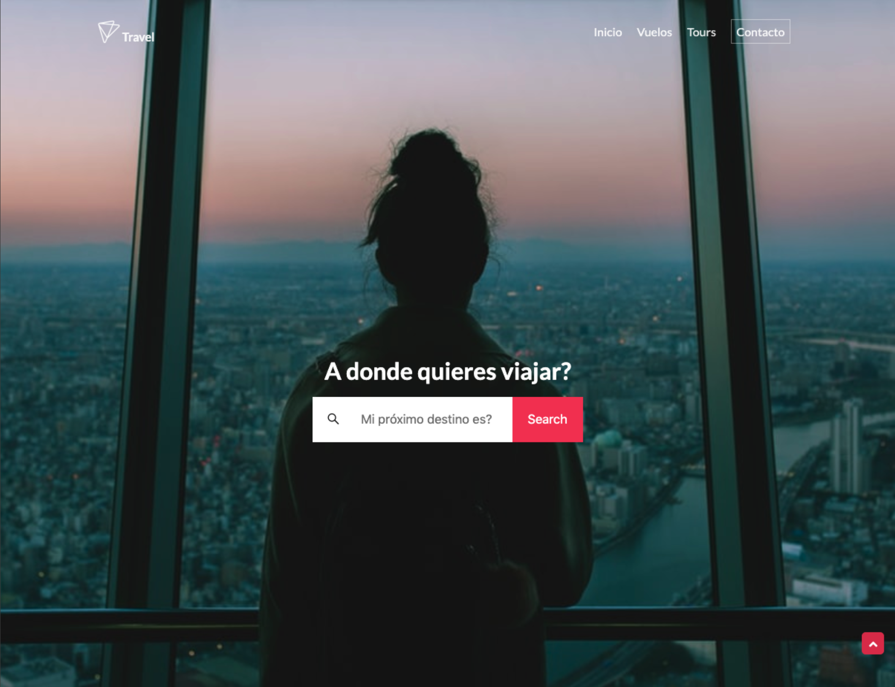
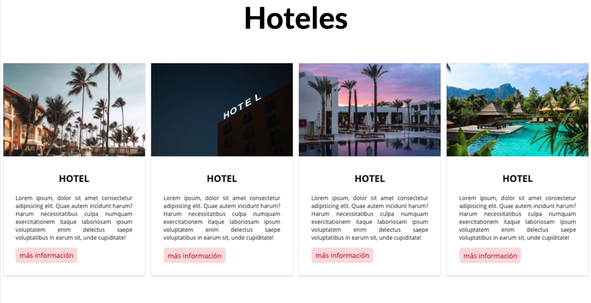
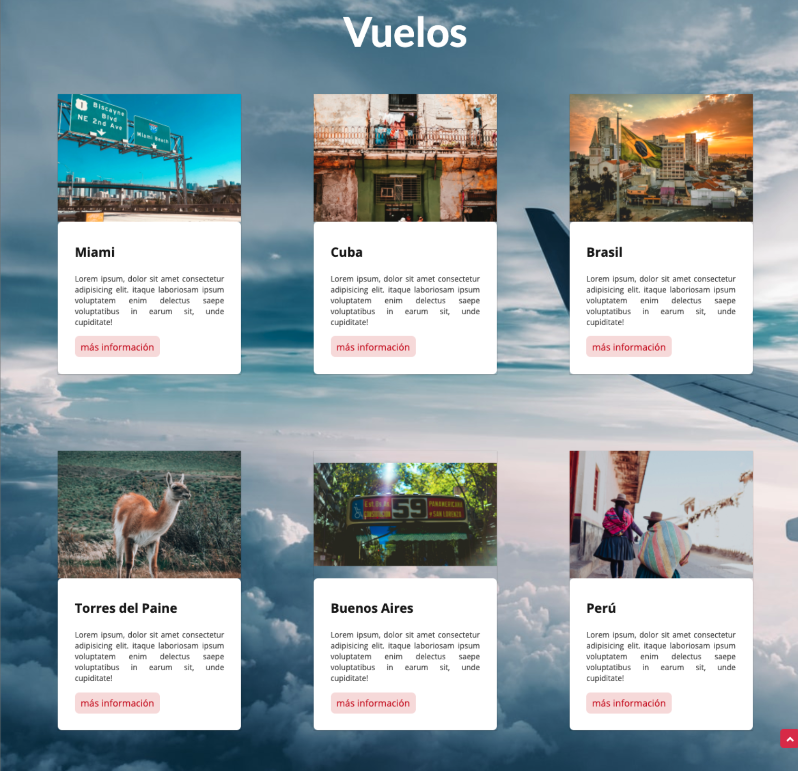
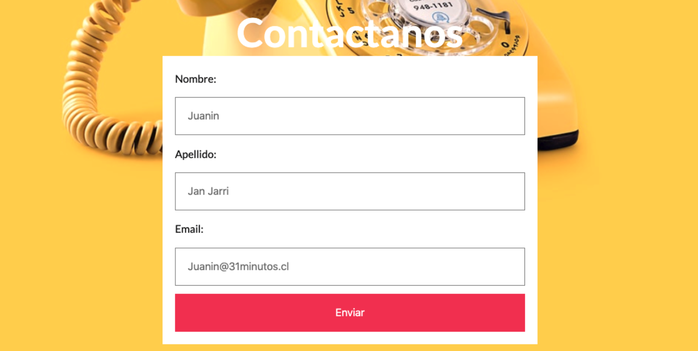

## Proyecto de maquetación
Se utilizaran los contenidos obtenidos en la clases:
- Html
- Git
- Css
Se considerar la estructura base entregada y realizar una página que cumpla con el siguiente layout:

## Layout: Inicio



## Layout: Hoteles



## Layout: Vuelos



## Layout: Contacto



## Recursos

- [Iconos de Fontawesome](https://fontawesome.com) 
- [Google fonts](https://fonts.google.com/specimen/Lato?query=lato) 
- Imágen  [Inicio](https://source.unsplash.com/G8rRItjrwkA) 
- Imágen [Vuelos](https://source.unsplash.com/BvuZn3FhEdU) 
- Imágen [Contacto](https://source.unsplash.com/-haAxbjiHds) 


## Requisitos
- Realizar una página Web utilizando Html y Css, considerando los layout presentados anteriormente.

- Utilizar distintas formas de posicionar los elementos en pantalla.  (float, flexbox, position)

- Utilizar hoja de estilos externas al documento.

- Usar técnicas que permita anular el comportamiento por defecto de los navegadores.

- Utilizar Font externas

- Utilizar fontAwesome para los iconos https://fontawesome.com

- El diseño se debe adaptar a teléfonos y tablet considerando las siguientes medias query para `320px`, `720px` y `1024px`.


- El proyecto deberá encontrarse en el repositorio  `github.com/mortegac/frenon-proyecto-maquetacion`.

- Deben utilizar la rama/branche con el formato `feat/mi-nombre`, las ramas disponibles son:
```
/yana-chernova
/roycer-cordova
/jose-lastra
/francisco-novoa
/gregory-rivero
/raul-ruiz
/hugo-uzabeaga
/jonathan-villena
```

- Al terminar el proyecto se debe deja entregar en https://classroom.google.com/ y dejarlo en la rama/branche creada


## No es permitido

- Uso de framework Css


## Se evaluará

- Uso de Git
- Uso de elementos semánticos en HTML
- Uso de Css
- Uso de medias Queries
